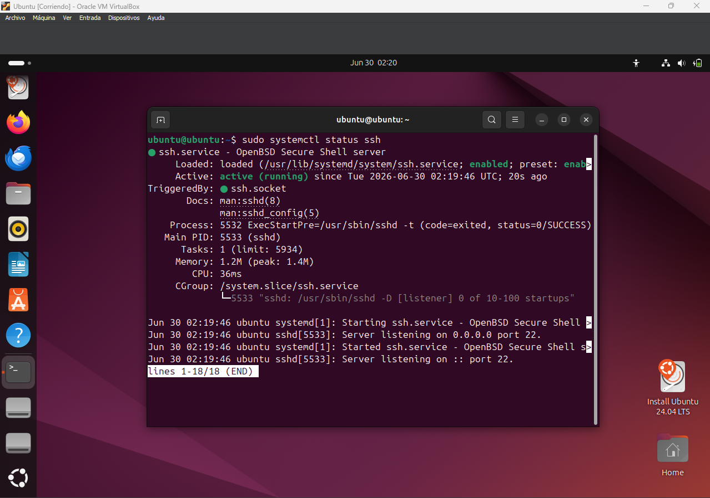
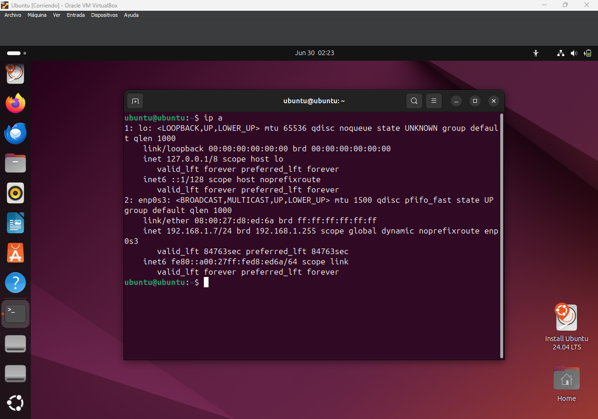
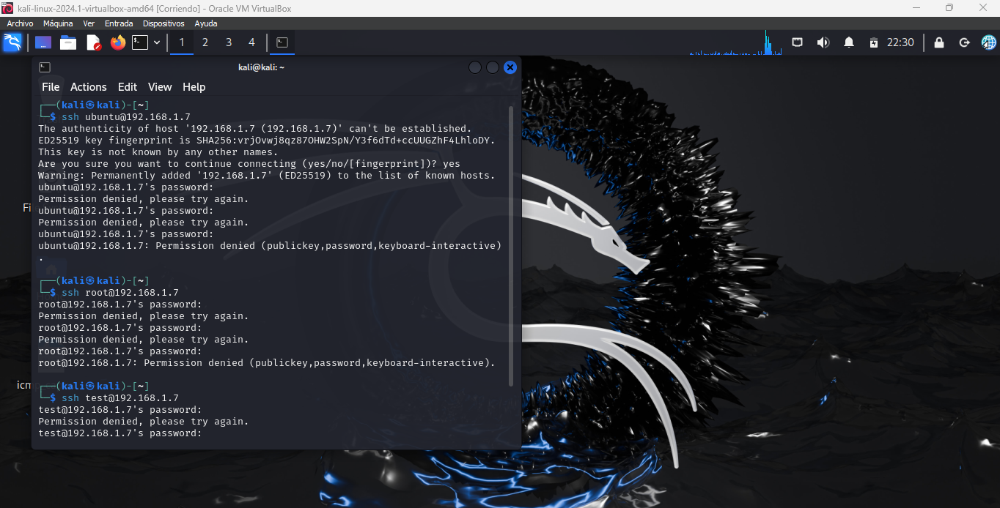
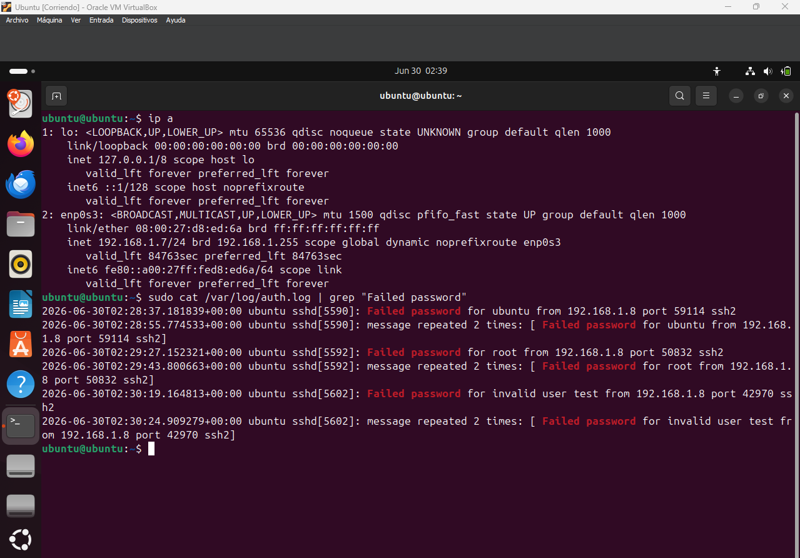
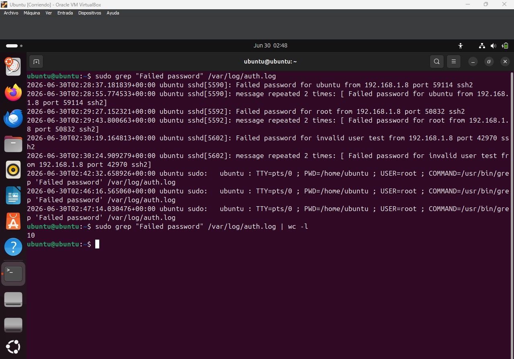
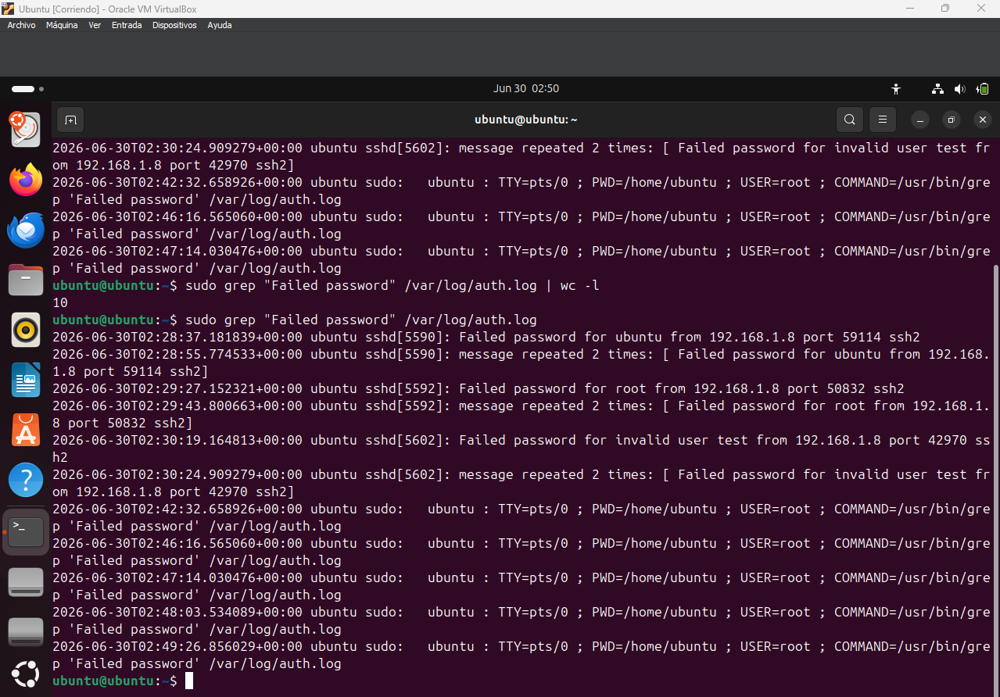

# Lab 03 - SSH Brute Force Detection

## Objective

Simulate and investigate an SSH brute force attack by generating multiple failed login attempts against an Ubuntu server and analyzing authentication logs to identify indicators of compromise.

---

## Skills Demonstrated

- Linux log analysis
- SSH authentication monitoring
- Brute force attack detection
- Security event investigation
- Incident documentation
- SOC Level 1 analysis

---

## Lab Environment

| Component | Description |
|-----------|-------------|
| Attacker Machine | Kali Linux |
| Target Machine | Ubuntu Server |
| Service | OpenSSH |
| Hypervisor | Oracle VM VirtualBox |

---

## Attack Scenario

A threat actor attempts to gain unauthorized access to an Ubuntu server by repeatedly trying different usernames and incorrect passwords through the SSH service.

As a SOC Analyst, the objective is to identify suspicious authentication activity by reviewing the system logs and determining the source of the attack.

---

## Tools Used

- Ubuntu Server
- Kali Linux
- OpenSSH
- grep
- cat
- wc
- Linux Terminal

---

# Step 1 – Verify SSH Service

Ensure the SSH service is installed and running.

```bash
sudo systemctl status ssh
```

### Screenshot



---

# Step 2 – Identify Target IP Address

Display the IP address of the Ubuntu server.

```bash
ip a
```

### Screenshot



---

# Step 3 – Generate Failed Login Attempts

From Kali Linux, attempt to connect using invalid credentials.

```bash
ssh admin@<Target-IP>
```

Repeat several times using different usernames.

### Screenshot



---

# Step 4 – Review Authentication Logs

Inspect the authentication logs generated by the failed SSH attempts.

```bash
sudo grep "Failed password" /var/log/auth.log
```

### Screenshot



---

# Step 5 – Count Failed Attempts

Count the number of failed authentication events.

```bash
sudo grep "Failed password" /var/log/auth.log | wc -l
```

### Screenshot



---

# Step 6 – Identify the Attacker IP

Identify the IP address responsible for the failed login attempts.

```bash
sudo grep "Failed password" /var/log/auth.log
```

### Screenshot



---

# Indicators of Compromise (IOCs)

- Multiple failed SSH authentication attempts
- Invalid usernames
- Repeated authentication failures
- Single source IP address
- Consecutive login failures

---

# Findings

- Multiple failed SSH login attempts were successfully detected.
- Authentication logs recorded every failed login attempt.
- The attack originated from a single source IP address.
- The observed behavior matches the characteristics of an SSH brute force attack.

---

# Recommendations

- Disable SSH root login.
- Implement SSH key-based authentication.
- Configure Fail2Ban to block repeated failed logins.
- Enforce strong password policies.
- Continuously monitor authentication logs.
- Enable alerting for excessive authentication failures.

---

# MITRE ATT&CK Mapping

| Technique | Description |
|-----------|-------------|
| **T1110.001** | Password Guessing |

---

# Repository Structure

```text
Lab-03-SSH-Brute-Force-Detection/
│
├── README.md
├── Report/
│   └── Lab03_Report.pdf
│
└── capturas/
    ├── verificacion-servicio-ssh.png
    ├── ip-servidor.png
    ├── generacion-ataque.png
    ├── revision-registros.png
    ├── conteo-eventos.png
    └── ip-atacante.png
```

---

# Conclusion

This laboratory demonstrated how a SOC Analyst can detect and investigate an SSH brute force attack by analyzing Linux authentication logs. The collected evidence made it possible to identify the attacker's IP address, quantify failed login attempts, and document the incident following security operations best practices.

---

## Author

**Juan Pablo González**

SOC Analyst Portfolio
