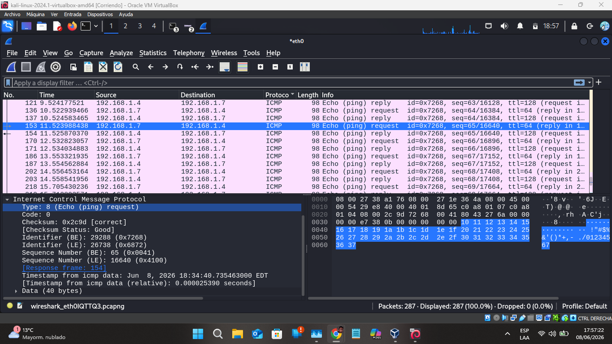
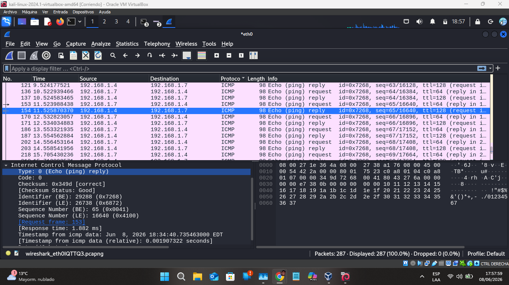

# Lab 01 - ICMP Traffic Analysis with Wireshark

## Overview

This lab demonstrates the capture and analysis of ICMP traffic between a Kali Linux machine and a Windows 10 machine using Wireshark.

The objective was to identify Echo Request and Echo Reply messages, verify connectivity, and analyze relevant packet characteristics.

---

## Objectives

* Capture ICMP traffic using Wireshark.
* Identify Echo Request and Echo Reply messages.
* Analyze source and destination IP addresses.
* Examine TTL values.
* Preserve evidence using PCAPNG files.

---

## Lab Environment

### Source Host

* Operating System: Kali Linux
* IP Address: 192.168.1.7

### Destination Host

* Operating System: Windows 10
* IP Address: 192.168.1.4

### Tools

* Wireshark
* Kali Linux
* Windows 10
* VirtualBox

---

## Network Topology

Kali Linux (192.168.1.7) generated ICMP traffic toward Windows 10 (192.168.1.4) using the ping command. Windows responded with Echo Reply messages.

---

## Key Findings

* ICMP Echo Request packets were identified from Kali Linux to Windows 10.
* ICMP Echo Reply packets were observed from Windows 10 to Kali Linux.
* Linux packets showed a TTL value of 64.
* Windows packets showed a TTL value of 128.
* Communication between both hosts was successful.

---

## Evidence

### Echo Request

### Echo Reply

---

## Files Included

* ICMP packet capture (.pcapng)
* Screenshots
* Full laboratory report (PDF)

---

## SOC Relevance

ICMP analysis is a fundamental skill for SOC analysts. It helps validate network connectivity, investigate suspicious traffic, and understand communication patterns between hosts.

---

## Conclusion

The lab successfully demonstrated ICMP traffic capture and analysis using Wireshark. The captured evidence allowed identification of request and response packets, source and destination hosts, and operating system indicators through TTL analysis.
