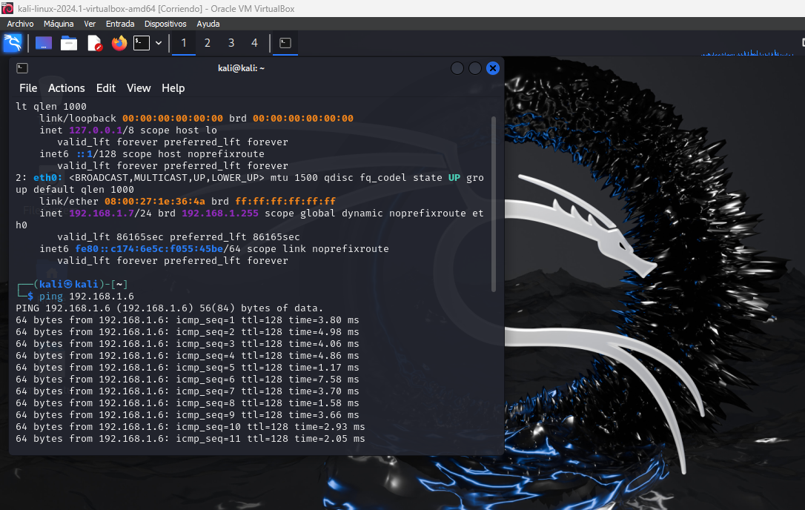
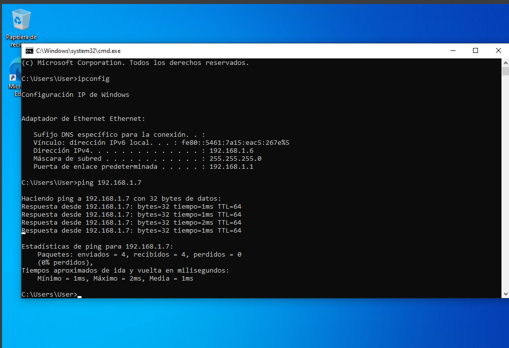
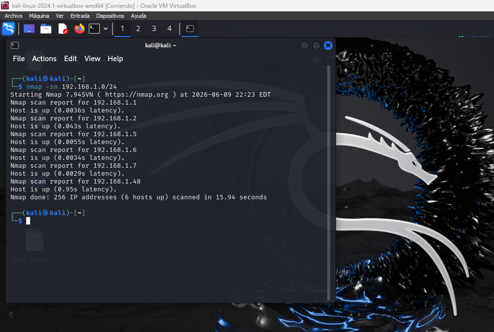
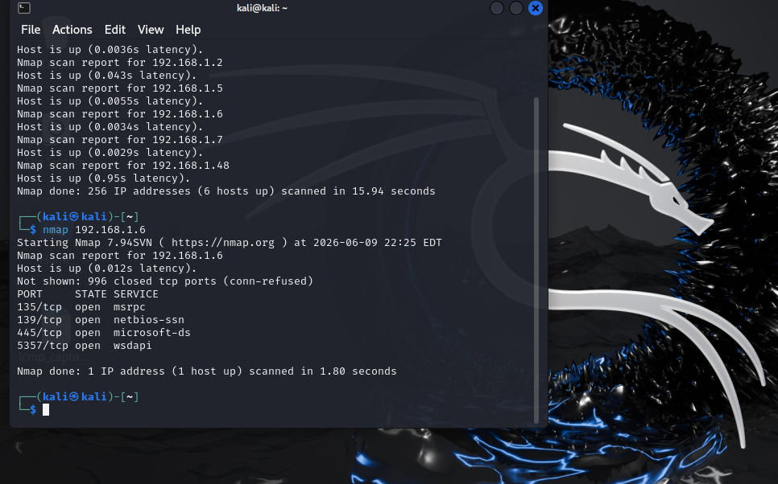
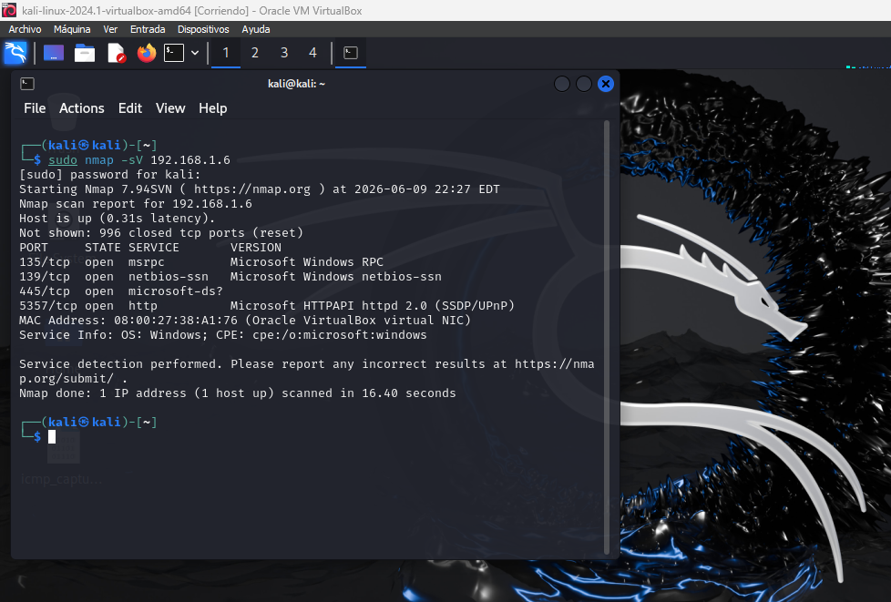
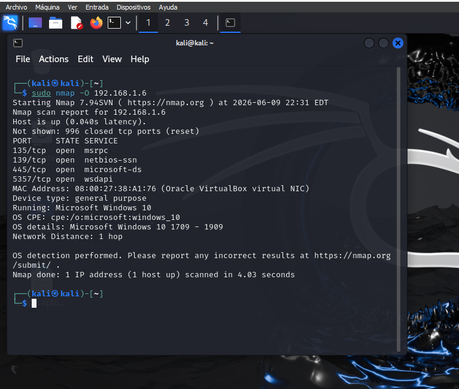
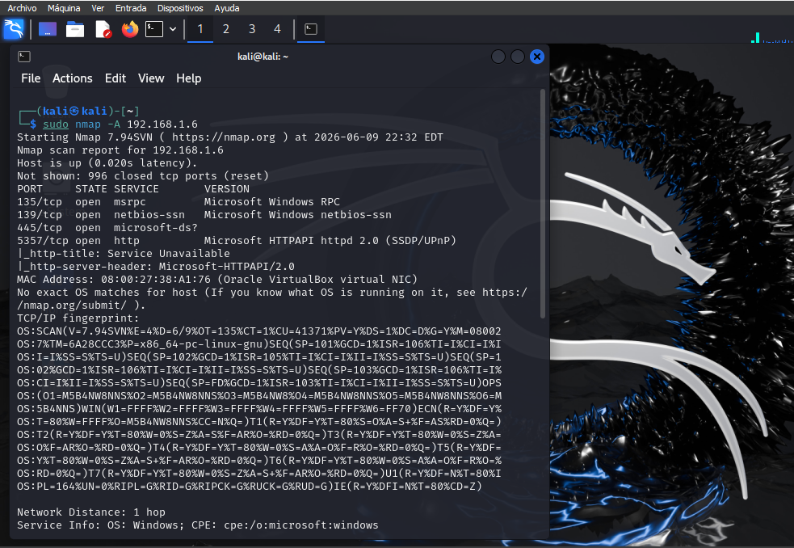
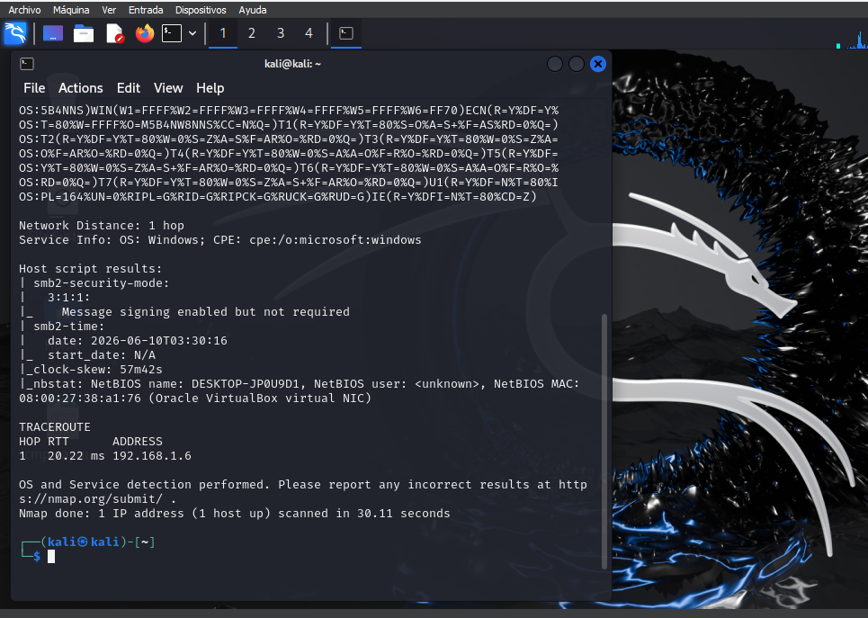

# Lab 02 - Network Discovery and Service Enumeration with Nmap

## Overview

This laboratory focuses on identifying active hosts, open ports, exposed services, and operating system characteristics using Nmap.

The activities performed simulate common reconnaissance and enumeration tasks carried out by SOC Level 1 Analysts to gain visibility into network assets and exposed services.

---

## Objectives

* Verify network connectivity between systems.
* Identify active hosts within the network.
* Detect open TCP ports.
* Enumerate services and service versions.
* Identify the target operating system.
* Analyze security-relevant information obtained from scans.

---

## Lab Environment

| Machine | Operating System  | IP Address  |
| ------- | ----------------- | ----------- |
| Analyst | Kali Linux 2024.1 | 192.168.1.7 |
| Target  | Windows 10        | 192.168.1.6 |

### Tools Used

* Nmap 7.94SVN
* Kali Linux
* Windows 10
* VirtualBox

---

## Methodology

### 1. Connectivity Verification

ICMP (Ping) was used to confirm communication between both systems.

### 2. Host Discovery

A network sweep was performed to identify active devices on the local subnet.

### 3. Basic Port Scan

An initial TCP port scan was conducted against the target host.

### 4. Service Enumeration

Service detection was performed to identify running services and their versions.

### 5. Operating System Detection

Nmap fingerprinting techniques were used to identify the target operating system.

### 6. Aggressive Scan

An advanced scan was executed to gather additional information about services, configurations, and host characteristics.

---

## Evidence

### Connectivity Verification

### Host Discovery

### Basic Port Scan

### Service Enumeration

### Operating System Detection

### Aggressive Scan

---

## Key Findings

* Six active hosts were identified within the local network.
* The Windows system exposed four open TCP ports: 135, 139, 445, and 5357.
* Microsoft RPC, NetBIOS, SMB, and HTTPAPI services were detected.
* The target operating system was successfully identified as Microsoft Windows 10.
* SMB signing was enabled but not required.
* No unusual or potentially malicious services were identified during the assessment.

---

## Security Recommendations

* Keep the operating system updated with the latest security patches.
* Restrict SMB access to authorized systems only.
* Configure SMB signing as required whenever possible.
* Continuously monitor ports 135, 139, and 445 due to their frequent use in lateral movement attacks.
* Implement network segmentation to reduce exposure of internal services.

---

## Conclusion

This laboratory demonstrated the use of Nmap for host discovery, port scanning, service enumeration, operating system detection, and advanced reconnaissance techniques.

The results provided valuable visibility into the target system's attack surface and exposed services, while reinforcing fundamental skills required for SOC Level 1 Analyst roles, including asset identification, network reconnaissance, service analysis, and security documentation.
