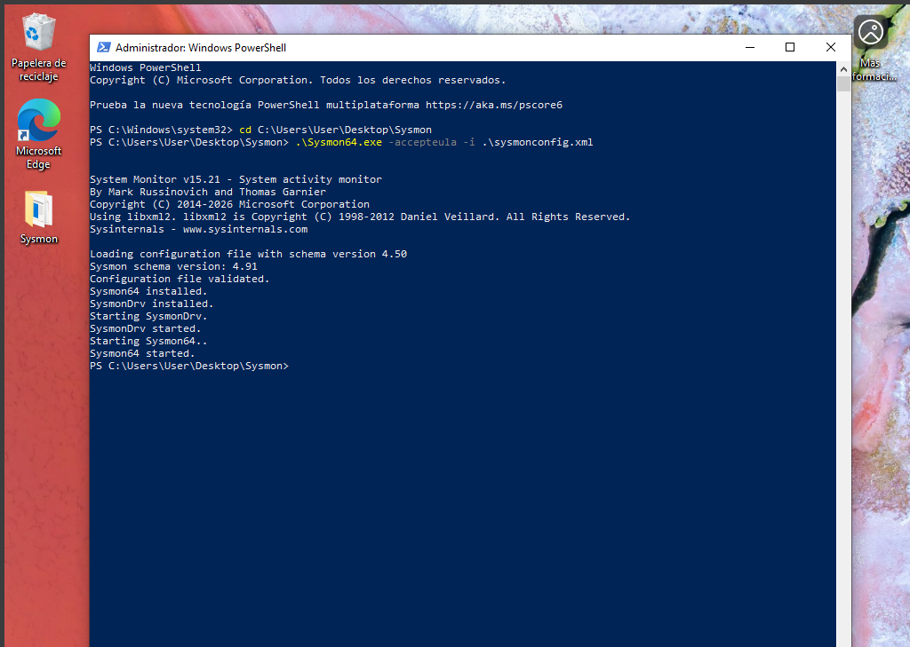
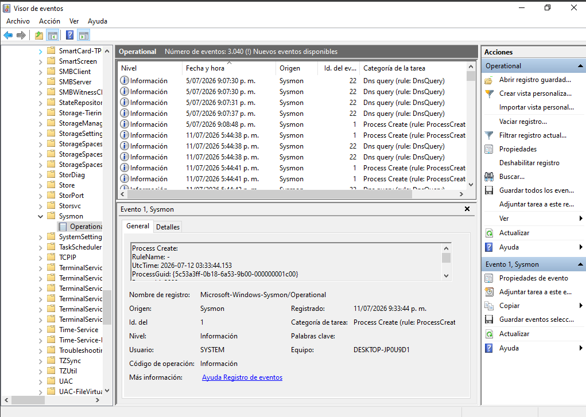
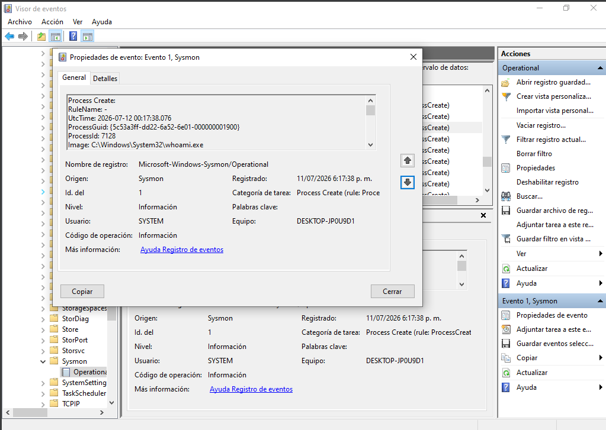
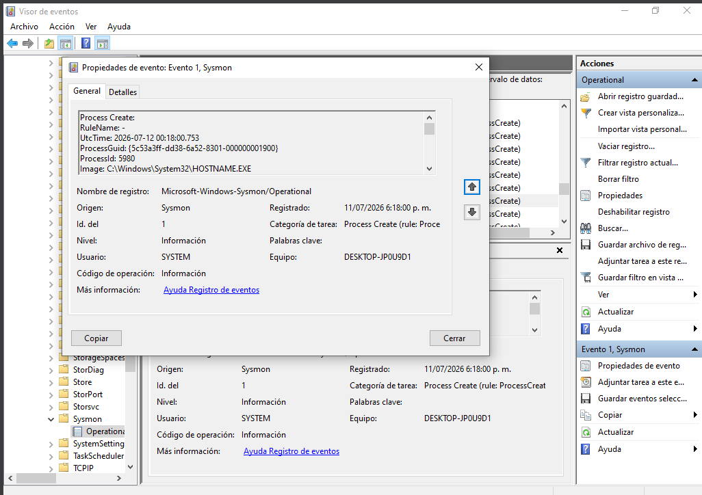
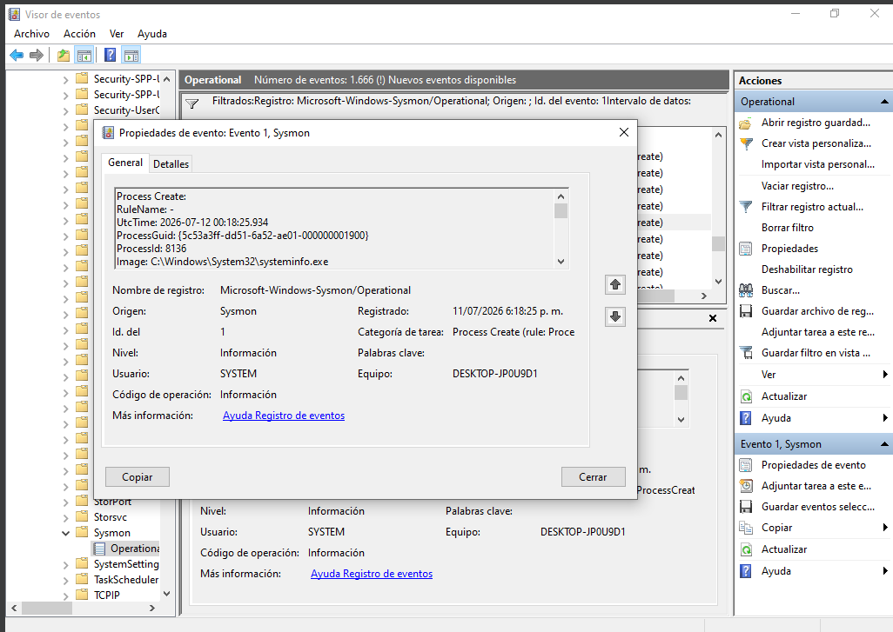
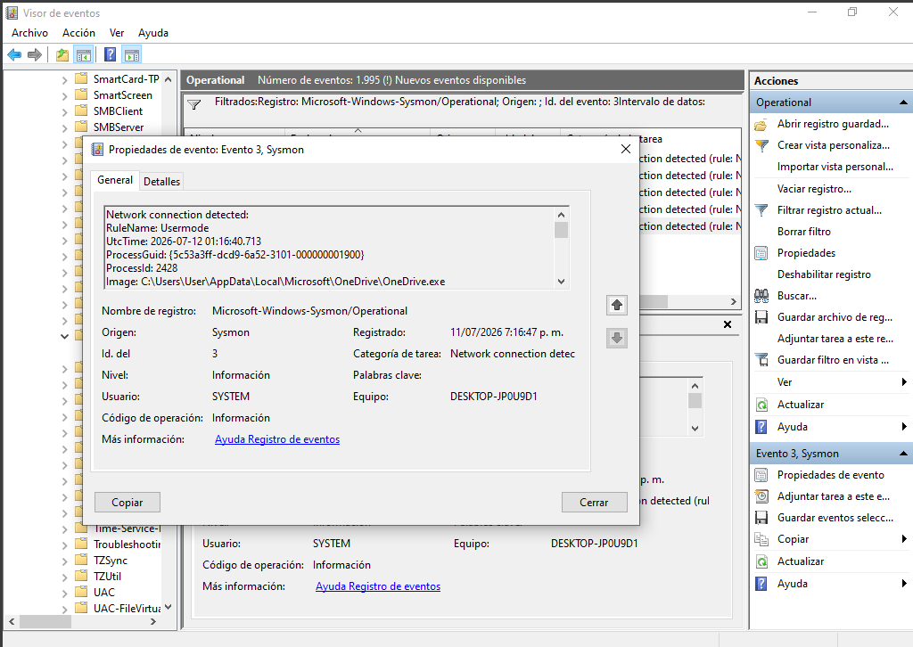
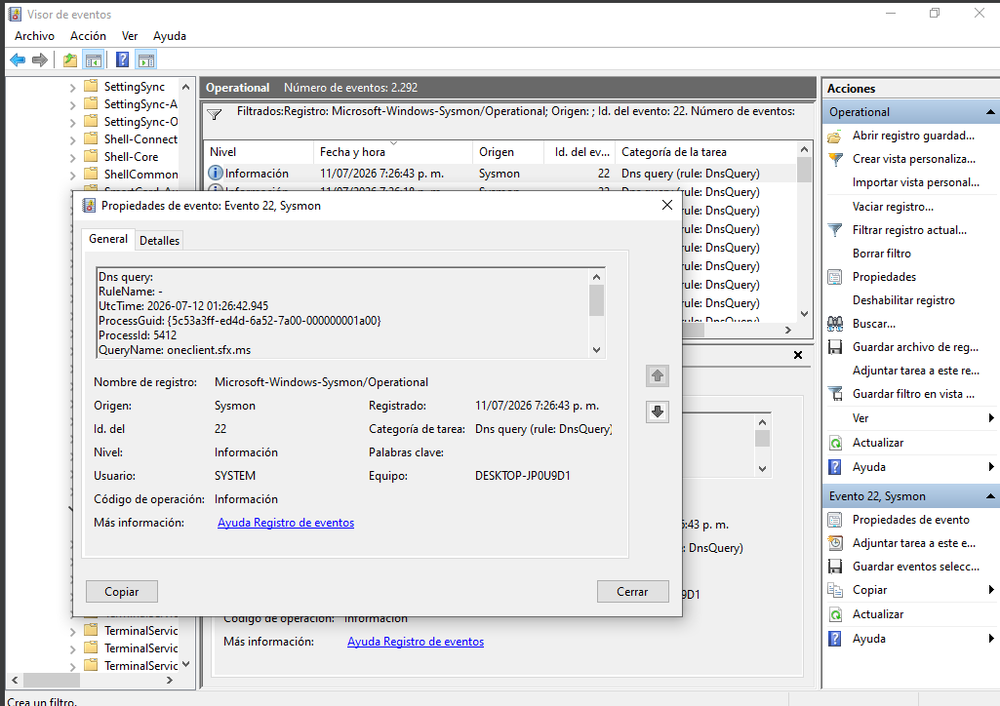

# Lab 04 - Sysmon Windows Event Investigation

## Objective

Deploy Sysmon on a Windows 10 virtual machine, generate endpoint activity, and investigate Windows Event Logs to identify process creation, network connections, and DNS queries commonly analyzed by SOC Analysts during endpoint investigations.

---

## Skills Demonstrated

- Windows Event Log Analysis
- Sysmon Deployment
- Endpoint Monitoring
- Process Creation Investigation
- Network Activity Analysis
- DNS Query Investigation
- Security Event Investigation
- SOC Level 1 Analysis

---

## Lab Environment

| Component | Description |
|-----------|-------------|
| Host Machine | Windows 11 Pro |
| Virtual Machine | Windows 10 Pro |
| Monitoring Tool | Sysmon v15 |
| Log Viewer | Windows Event Viewer |
| Hypervisor | Oracle VM VirtualBox |

---

## Investigation Scenario

A Windows workstation generated several security events that require investigation.

As a SOC Analyst, the objective is to review Sysmon logs, identify executed processes, analyze network activity, and reconstruct user actions using endpoint telemetry collected during the investigation.

---

## Tools Used

- Windows 10
- Sysmon
- Windows Event Viewer
- Command Prompt (CMD)
- PowerShell
- Oracle VM VirtualBox

---

# Step 1 – Install Sysmon

Install Sysmon using the configuration file and verify that the service starts successfully.

### Screenshot



---

# Step 2 – Verify Sysmon Operational Log

Open Windows Event Viewer and verify that the **Microsoft-Windows-Sysmon/Operational** log is available.

### Screenshot



---

# Step 3 – Generate Endpoint Activity

Execute the following Windows commands from Command Prompt to generate endpoint telemetry.

```cmd
whoami
hostname
ipconfig
```

### Screenshot


---

# Step 4 – Investigate Process Creation Events

Review **Event ID 1 (Process Create)** generated by the executed commands.

Analyze the following events:

- whoami.exe
- hostname.exe
- ipconfig.exe

### Screenshot

#### whoami.exe



#### hostname.exe



#### ipconfig.exe



---

# Step 5 – Investigate Network Connection Events

Review **Event ID 3 (Network Connection)** to identify outbound communications generated by Windows processes.

### Screenshot



---

# Step 6 – Investigate DNS Query Events

Review **Event ID 22 (DNS Query)** to determine which domains were resolved by Windows processes.

### Screenshot



---

# Indicators of Compromise (IOCs)

- Process creation events
- Executed Windows reconnaissance commands
- Network connections
- DNS queries
- Endpoint telemetry collected by Sysmon

---

# Findings

- Sysmon successfully captured endpoint activity generated during the investigation.
- Process Creation (Event ID 1) recorded the execution of Windows reconnaissance commands.
- Network Connection (Event ID 3) provided visibility into outbound communications.
- DNS Query (Event ID 22) identified domains accessed by Windows processes.
- Windows Event Viewer enabled reconstruction of endpoint activity using Sysmon telemetry.

---

# Recommendations

- Deploy Sysmon across Windows endpoints.
- Maintain an updated Sysmon configuration.
- Continuously monitor Event IDs related to process creation and network activity.
- Correlate Sysmon logs with SIEM alerts.
- Investigate unexpected process executions and suspicious DNS activity.

---

# MITRE ATT&CK Mapping

| Technique | Description |
|-----------|-------------|
| **T1033** | System Owner/User Discovery |
| **T1082** | System Information Discovery |
| **T1016** | System Network Configuration Discovery |

---

# Repository Structure

```text
Lab-04-Sysmon-Windows-Event-Investigation/
│
├── README.md
├── Report/
│   └── Lab04_Report.pdf
│
└── capturas/
    ├── sysmon-instalacion.png
    ├── sysmon-operational.png
    ├── generacion-eventos-cmd.png
    ├── eventid1-whoami.png
    ├── eventid1-hostname.png
    ├── eventid1-ipconfig.png
    ├── eventid3-networkconnection.png
    └── eventid22-dnsquery.png
```

---

# Conclusion

This laboratory demonstrated how Sysmon enhances endpoint visibility by recording detailed Windows security events. Through the investigation of Process Creation, Network Connection, and DNS Query events, it was possible to reconstruct endpoint activity and understand how endpoint telemetry supports incident response and threat hunting within a SOC environment.

---

## Author

**Juan Pablo González**

SOC Analyst Portfolio
