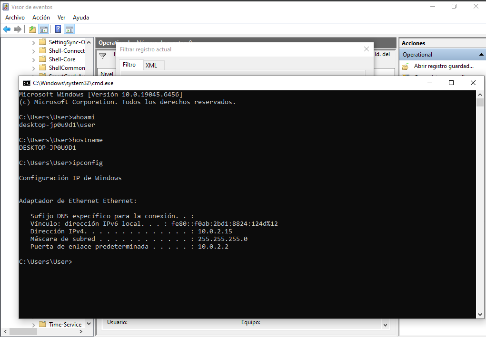

# Lab 04 – Sysmon Investigation: Windows Host Activity Analysis

## Overview

This lab demonstrates how Sysmon can be used to monitor and investigate activity on a Windows endpoint. After deploying Sysmon with a community configuration, Windows Event Viewer was used to analyze process creation, network connections, and DNS queries generated during a simulated investigation.

The objective was to understand how endpoint telemetry can be leveraged to reconstruct user activity and identify behaviors commonly observed during the reconnaissance phase of an attack.

---

## Objectives

- Deploy Sysmon on a Windows 10 virtual machine.
- Configure Sysmon using a community configuration file.
- Generate Windows activity for analysis.
- Investigate Sysmon logs using Event Viewer.
- Identify Process Creation, Network Connection, and DNS Query events.
- Relate collected evidence to MITRE ATT&CK techniques.

---

## Lab Environment

| Component | Description |
|----------|-------------|
| Host OS | Windows 11 Pro |
| Virtualization | Oracle VirtualBox |
| Guest OS | Windows 10 Pro |
| Monitoring Tool | Sysmon v15 |
| Log Viewer | Windows Event Viewer |

---

## Tools Used

- Sysmon
- Windows Event Viewer
- PowerShell
- Command Prompt (CMD)
- VirtualBox

---

## Scenario

A SOC analyst receives an alert indicating recent activity on a Windows workstation. The objective is to review the endpoint telemetry collected by Sysmon and reconstruct the actions performed by the user.

Several standard Windows commands were executed to simulate a basic host reconnaissance phase. The generated telemetry was then analyzed using Windows Event Viewer.

---

## Activities Performed

- Installed Windows 10 virtual machine.
- Installed and configured Sysmon.
- Verified Sysmon Operational logs.
- Generated endpoint activity using:
  - `whoami`
  - `hostname`
  - `ipconfig`
- Investigated Process Creation events (Event ID 1).
- Investigated Network Connection events (Event ID 3).
- Investigated DNS Query events (Event ID 22).

---

## Evidence

### Sysmon Installation

Sysmon was successfully installed and configured using the Sysmon Modular configuration file. After installation, the **Microsoft-Windows-Sysmon/Operational** log became available in Windows Event Viewer.

---

## Process Creation (Event ID 1)

### User Discovery – whoami.exe

The execution of `whoami.exe` generated a Sysmon Event ID 1, recording the process creation along with its image path, Process GUID, Process ID, and execution timestamp.

This command is commonly used during host reconnaissance to identify the current security context.

---

### System Identification – hostname.exe

Sysmon captured the execution of `hostname.exe`, allowing investigators to determine when the workstation name was queried.

This information is valuable during incident response because it helps correlate activity with a specific endpoint.

---

### Network Configuration Discovery – ipconfig.exe

Executing `ipconfig.exe` generated another Process Creation event.

This command is frequently observed during the Discovery phase, as it reveals IP addressing, gateway information, and active network interfaces.

---

## Network Connection (Event ID 3)

Sysmon detected outbound network activity generated by a Windows process.

These events allow analysts to determine which processes establish external communications, supporting threat hunting and incident investigations.

---

## DNS Query (Event ID 22)

Sysmon successfully recorded DNS resolution activity performed by Windows processes.

DNS telemetry is particularly useful for identifying communications with suspicious domains and detecting potential command-and-control infrastructure.

## Skills Demonstrated

- Windows Endpoint Monitoring
- Sysmon Deployment
- Windows Event Logs Analysis
- Event Correlation
- Process Monitoring
- DNS Monitoring
- Network Activity Investigation
- Endpoint Telemetry Analysis
- Security Investigation

---

## MITRE ATT&CK Mapping

| Technique | Description |
|----------|-------------|
| TA0007 – Discovery | System reconnaissance using Windows commands |
| T1082 | System Information Discovery |
| T1016 | System Network Configuration Discovery |
| T1033 | System Owner/User Discovery |
| TA0011 – Command and Control | DNS monitoring and network visibility |

---

## Key Findings

- Sysmon successfully captured endpoint telemetry.
- Process creation events enabled reconstruction of executed commands.
- Network Connection events provided visibility into outbound communications.
- DNS Query events revealed domain resolution performed by Windows processes.
- Event correlation allowed reconstruction of user activity during the investigation.

---

## Conclusion

This lab demonstrates how Sysmon enhances Windows endpoint visibility by collecting detailed security telemetry. Through the analysis of Process Creation, Network Connection, and DNS Query events, it was possible to reconstruct system activity and illustrate how these logs support incident response and threat hunting within a SOC environment.
