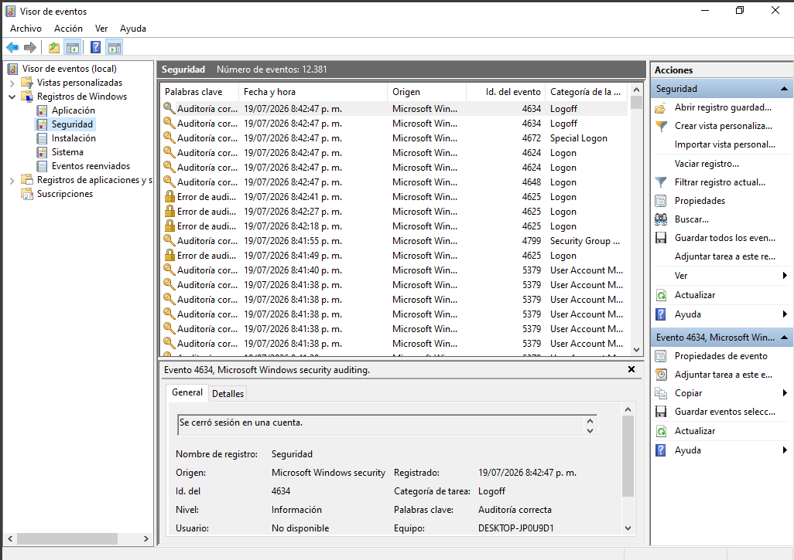
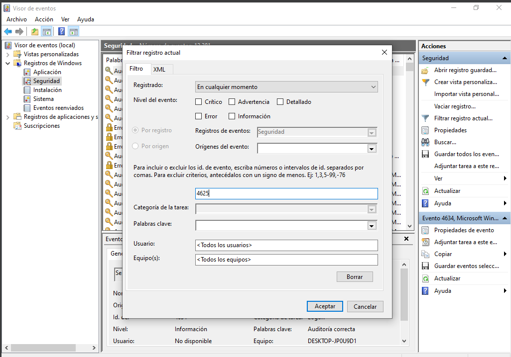
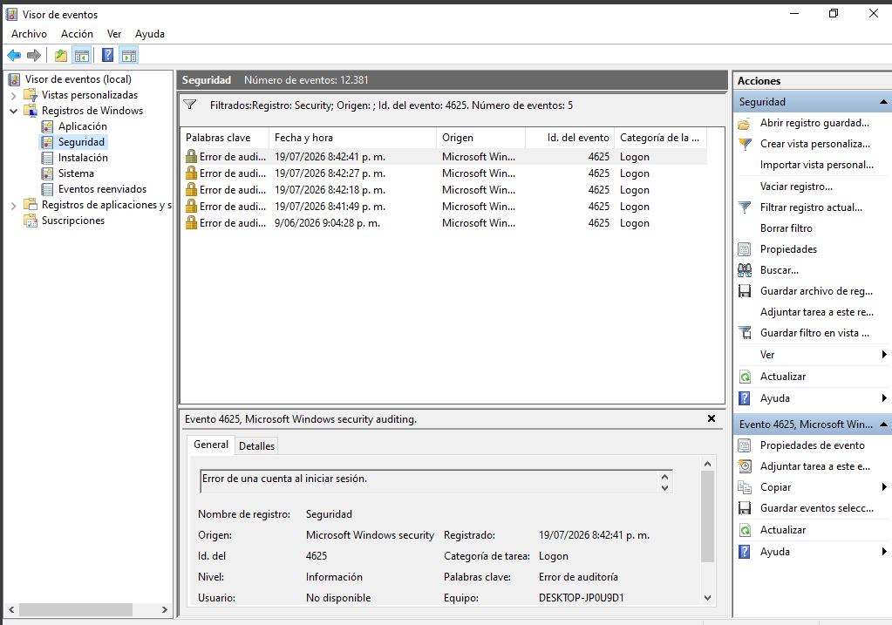
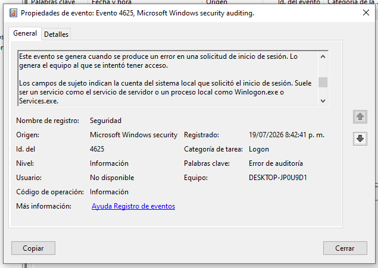
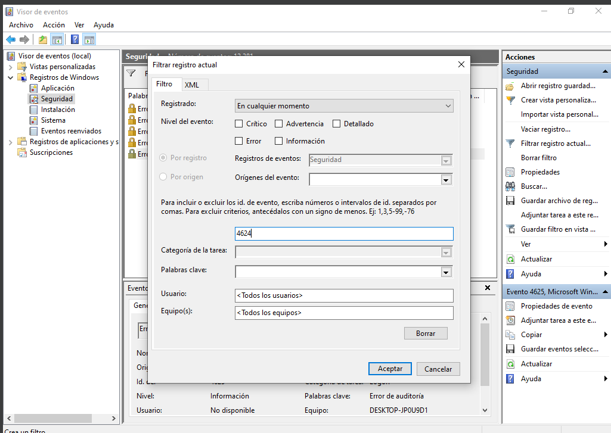
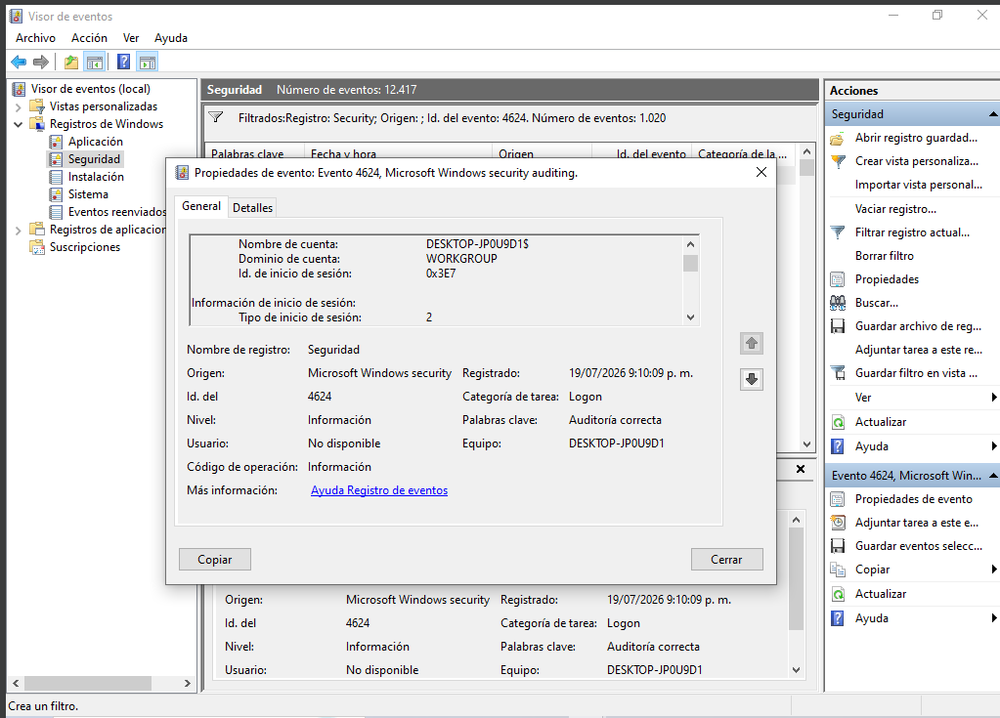

# 🔐 Lab 05 – Windows Failed Login Investigation

## 📌 Objective

Simulate and investigate multiple failed login attempts against a Windows 10 workstation by analyzing Windows Security Event Logs.

The objective of this lab is to identify authentication failures, verify whether a successful login occurred afterward, and document the findings following a SOC Level 1 investigation methodology.

---

# 🎯 Skills Demonstrated

- Windows Security Log Analysis
- Event Viewer Investigation
- Authentication Monitoring
- Failed Login Detection
- Windows Security Event Analysis
- IOC Identification
- MITRE ATT&CK Mapping
- Incident Documentation
- SOC Level 1 Investigation

---

# 🖥️ Lab Environment

| Component | Description |
|-----------|-------------|
| Operating System | Windows 10 |
| Platform | Oracle VirtualBox |
| Analysis Tool | Windows Event Viewer |
| Log Source | Windows Security Logs |
| User Account | Local User (`User`) |

---

# 📖 Scenario

A Windows workstation generated multiple failed authentication attempts against a local user account.

As a SOC Analyst, the objective is to determine:

- Which account was targeted.
- Whether authentication attempts were successful.
- Which Windows Security events were generated.
- Whether the observed behavior is consistent with a brute force attack.

---

# 🛠️ Procedure

## Step 1 – Failed Authentication Attempts

The workstation session was locked and multiple incorrect passwords were entered for the local account **User**.

Windows generated several **Event ID 4625** entries.

---

## Step 2 – Successful Authentication

After multiple failed attempts, the correct password was entered.

Windows generated **Event ID 4624**, confirming a successful interactive logon.

---

## Step 3 – Event Investigation

Using **Windows Event Viewer**, the Security Log was filtered to analyze the following events:

- Event ID **4625**
- Event ID **4624**

---

# 📷 Evidence

## 1. Windows Security Log

---

## 2. Security Log Filter (Event ID 4625)

---

## 3. Failed Login Events

---

## 4. Event ID 4625 Details

| Field | Value |
|--------|--------|
| Event ID | 4625 |
| Event Type | Failed Logon |
| Target Account | User |
| Audit Result | Failure Audit |

---

## 5. Security Log Filter (Event ID 4624)

---

## 6. Event ID 4624 Details

| Field | Value |
|--------|--------|
| Event ID | 4624 |
| User | User |
| Logon Type | 2 |
| Audit Result | Success Audit |

---

# 🔍 Investigation

## Failed Authentication Analysis

Multiple failed authentication attempts were identified targeting the local account **User**.

Windows Security Logs confirmed that:

- The account exists.
- Authentication requests reached the workstation.
- Invalid credentials were supplied.
- Windows rejected each authentication attempt.

---

## Successful Authentication Analysis

Following the failed attempts, Windows recorded a successful authentication event.

| Field | Value |
|--------|--------|
| User | User |
| Event ID | 4624 |
| Logon Type | 2 (Interactive Logon) |

A **Logon Type 2** indicates an interactive logon performed directly from the workstation keyboard and monitor.

This confirms that valid credentials were eventually supplied.

---

# 🚩 Indicators of Compromise (IOCs)

| Indicator | Value |
|-----------|-------|
| Target User | User |
| Failed Logon Event | 4625 |
| Successful Logon Event | 4624 |
| Logon Type | 2 |
| Hostname | DESKTOP-JP0U9D1 |
| Log Source | Windows Security Log |

---

# 🛡️ MITRE ATT&CK Mapping

| Tactic | Technique | ID |
|---------|-----------|----|
| Credential Access | Brute Force | T1110 |

---

# 📊 Findings

The investigation identified multiple failed authentication attempts followed by a successful interactive login using the same local account.

Although this activity was intentionally generated in a controlled laboratory environment, a similar event sequence in a production environment could indicate:

- Password Guessing
- Brute Force Attack
- Legitimate user authentication after multiple failed attempts

Additional context such as source IP address, endpoint telemetry, user activity, and authentication history would be required before determining whether the activity was malicious.

---

# 📚 Key Takeaways

- Identified failed authentication attempts using Windows Security Event ID **4625**.
- Confirmed successful authentication through Event ID **4624**.
- Correlated authentication events during a Windows security investigation.
- Identified indicators of compromise (IOCs).
- Mapped the activity to **MITRE ATT&CK T1110 – Brute Force**.
- Documented the investigation following a SOC Level 1 incident response methodology.

---

# ✅ Conclusion

This laboratory demonstrates how Windows Security Logs can be used to investigate authentication events through Event Viewer.

By analyzing **Event ID 4625** and **Event ID 4624**, it was possible to identify failed and successful authentication attempts, determine the affected account, and correlate security events during an authentication investigation.

This exercise reinforces essential SOC Analyst Level 1 skills including Windows log analysis, authentication monitoring, event correlation, IOC identification, MITRE ATT&CK mapping, and technical incident documentation.

---

# 📚 References

- Microsoft Learn – Windows Security Auditing
- Event ID 4624 – Successful Logon
- Event ID 4625 – Failed Logon
- MITRE ATT&CK – T1110 Brute Force

---

# ⭐ SOC Analyst Portfolio

This project is part of my hands-on cybersecurity portfolio focused on:

- SOC Level 1 Investigations
- Threat Detection
- Windows Log Analysis
- Network Security
- Incident Response
- Malware Analysis
- Digital Forensics
